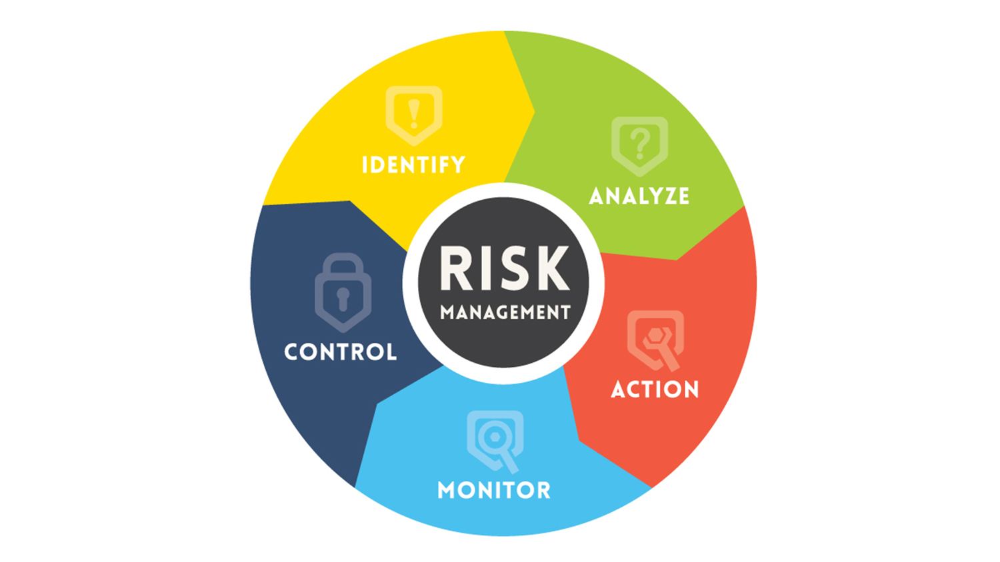

# Home Network Risk Assessment

### Home Network Description: 
A typical suburban home with various connected devices, including two laptops, three smartphones, a smart TV, a gaming console, and a Wi-Fi-enabled home security system.

### Define the Scope:
#### Objective: 
- Ensure the security and integrity of the home network and the devices connected to it.
#### Boundaries: 
- Includes all devices connected to the Wi-Fi network and any wired connections.

### Identify Potential Risks:
| Risk Category  | Description |
| ------------- | ------------- |
| Unauthorized Access | Risk of hackers gaining access to the network |
| Malware and Viruses | Devices getting infected, leading to data theft or loss |
| Phishing Attacks | Family members might inadvertently disclose sensitive information |
| Weak Passwords | Use of default or weak passwords on devices and network |
| Outdated Software | Unpatched vulnerabilities due to outdated software on devices |
| Data Interception | Unencrypted data being intercepted over the network |
| Device Theft or Loss | Mobile devices getting lost or stolen, posing a data risk |
| Network Overload or Failure | Network becoming overloaded or failing, leading to a loss of service |

### Analyze Risks:
| Risk  | Likelihood | Impact |
| ------------- | ------------- | ------------- |
| Unauthorized Access | High | High |
| Malware and Viruses | Medium | High |
| Phishing Attacks | Low | Medium |
| Weak Passwords | High | High |
| Outdated Software | Medium | High |
| Data Interception | Low | High |
| Device Theft or Loss | Low | Medium |
| Network Overload or Failure | Low | Low |

### Risk Evaluation and Prioritization:
Prioritize risks like unauthorized access, malware, and weak passwords due to their high likelihood and impact.

### Develop Risk Mitigation Strategies:
| Risk  | Mitigation Strategies |
| ------------- | ------------- |
| Unauthorized Access | Implement a strong firewall and secure Wi-Fi with WPA3 encryption |
| Malware and Viruses | Install reputable antivirus software on all devices |
| Phishing Attacks | Educate family members about the risks of phishing |
| Weak Passwords | Set strong, unique passwords for all devices and change them regularly |
| Outdated Software | Enable automatic updates for all devices and software |
| Data Interception | Use VPN services for sensitive online activities |
| Device Theft or Loss | Enable tracking and remote wipe capabilities on mobile devices |
| Network Overload or Failure | Regularly reboot the router and consider a backup internet option |

### Implement Risk Mitigation Measures:
Carry out the strategies listed above.
Schedule regular check-ups to ensure measures are in place and effective.

### Monitor and Review:
Regularly check network logs for unusual activity.
Review and update the risk assessment annually or when significant changes occur in the network setup.

### Documentation:
Keep detailed records of the risk assessment process, including identified risks, analysis, and mitigation strategies.

### Incident Response Plan:
Develop a basic response plan for different scenarios, such as data breaches or lost devices.
